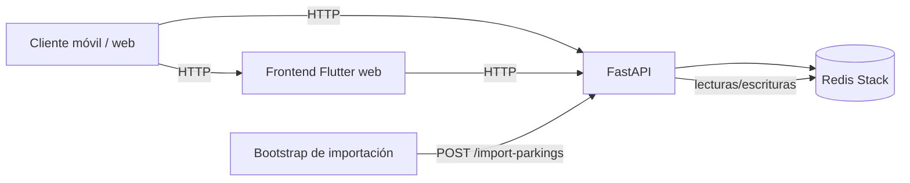

# Arquitectura del sistema

> AparCáceres está organizado como un sistema de catálogo geoespacial simple
> de operar, claro de extender y preparado para despliegue reproducible.

## 🧭 Visión general

AparCáceres se compone de cuatro piezas principales:

• Backend en FastAPI, responsable del contrato HTTP y de la lógica de negocio
  del catálogo.
• Frontend Flutter, responsable de la experiencia de usuario y del consumo del
  API.
• Redis Stack, base de datos principal, motor de búsqueda y persistencia de
  favoritos, cachés y catálogo.
• `docker compose`, topología reproducible para desarrollo y despliegue.

El objetivo del diseño es separar responsabilidades con claridad para que la
capa HTTP no mezcle persistencia, búsqueda y reglas de dominio en un mismo
módulo.

## 🏗️ Topología

En `docker compose` los servicios relevantes son:

• `redis`: Redis Stack con AOF y RDB.
• `api`: backend FastAPI.
• `bootstrap`: importación inicial del catálogo.
• `web`: frontend Flutter web servido por nginx.

## 🧩 Backend

### Composición

El punto de entrada es [`backend/main.py`](../backend/main.py). Ese archivo
ensambla la aplicación FastAPI, registra middlewares y monta routers.

La estructura interna se organiza por responsabilidad:

• `app/core/`: configuración, autenticación, logging, métricas y rate limit.
• `app/infra/redis/`: cliente Redis, búsqueda RediSearch, importador y
  resolución de fotos.
• `app/routers/`: adaptadores HTTP por dominio.
• `app/schemas.py`: contrato de entrada y salida.
• `app/filters.py` y `app/normalization.py`: lógica pura reutilizable por
  backend y tests.

### Capa HTTP

Los routers tienen un papel de orquestación:

- validan y normalizan parámetros;
- delegan la lógica de persistencia o búsqueda en la infraestructura Redis;
- traducen errores a respuestas HTTP;
- exponen ejemplos OpenAPI y contratos estables.

Los endpoints más relevantes son:

• `GET /parkings`
• `GET /parkings/nearby`
• `GET /parkings/in-bounds`
• `GET /parkings/facets`
• `GET /users/me/favorites`
• `POST /import-parkings`
• `GET /healthz`

### Infraestructura

La capa `app/infra/redis/` concentra la parte sensible del backend:

- el ciclo de vida de los clientes Redis;
- la consulta con RediSearch;
- el importador con doble buffer;
- la resolución de fotos del SIG municipal.

Esta separación evita dispersar claves, índices y decisiones de persistencia
por todo el código.

## 📱 Frontend Flutter

El frontend sigue una arquitectura por capas sencilla:

• `lib/core/`: configuración, cliente HTTP, sesión auth y providers.
• `lib/features/`: pantallas, datos y dominio por funcionalidad.
• `lib/shared/`: widgets, constantes y estilos reutilizables.
• `lib/theme/`: sistema visual.

La aplicación se conecta al backend por HTTP, no directamente a Redis. El
frontend mantiene su propia capa de estado y deja que el backend resuelva el
contrato de datos.

## 🔁 Flujo de datos

### Consulta

• El usuario interactúa con Flutter.
• Flutter llama a FastAPI.
• FastAPI consulta Redis Stack o devuelve el contrato desde hashes.
• FastAPI responde con JSON estable.
• Flutter hidrata modelos de dominio y pinta la UI.

### Importación

• `POST /import-parkings` lee los GeoJSON del directorio de datos.
• El importador normaliza los features al contrato público.
• Se escribe una generación de staging en Redis.
• Se intercambia la generación activa con un swap controlado.
• Se invalida la caché de nearby incrementando `cache:version`.

### Favoritos

• El cliente obtiene un JWT de sesión.
• El backend almacena los favoritos en un sorted set por usuario.
• La pantalla de favoritos lee el catálogo canónico desde Redis.

## 🎯 Decisiones de diseño

• **Redis Stack como base principal**: no actúa como caché secundaria, sino
  como almacenamiento canónico del catálogo y motor de consulta.
• **Búsqueda sin degradación silenciosa**: si RediSearch no está disponible, la
  búsqueda falla de forma explícita.
• **Importación con staging y swap**: el catálogo se reconstruye antes de
  sustituir la generación activa para reducir ventanas de inconsistencia.
• **Sin ORM ni repositorios genéricos**: el dominio es acotado y la complejidad
  real reside en el modelado sobre Redis.
• **Dobles de prueba aislados**: los fallbacks en memoria quedan restringidos a
  tests; producción no contiene lógica equivalente.

## 📚 Documentación relacionada

• [`README.md`](../README.md): entrada principal del proyecto.
• [`docs/operations.md`](operations.md): despliegue y operación.
• [`docs/redis.md`](redis.md): modelado y uso de Redis Stack.
