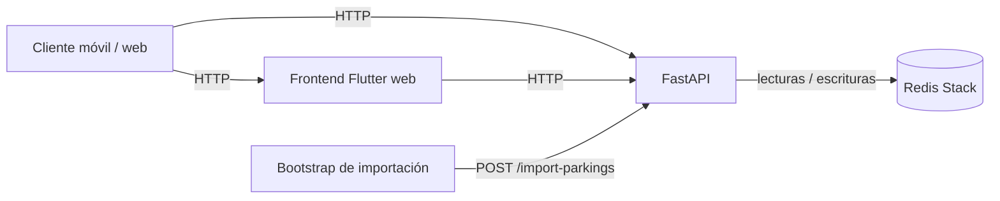

# Arquitectura del sistema

<div style="margin-top: 2.5rem"></div>

> AparCáceres está organizado como un sistema de catálogo geoespacial simple de operar, claro de extender y preparado para despliegue reproducible.

<div style="margin-top: 2.5rem"></div>

---

## 🧭 Visión general

AparCáceres se compone de cuatro piezas principales:

| Componente | Responsabilidad |
|---|---|
| **Backend FastAPI** | Contrato HTTP y lógica de negocio del catálogo |
| **Frontend Flutter** | Experiencia de usuario y consumo de la API |
| **Redis Stack** | Base de datos principal, motor de búsqueda y persistencia |
| **Docker Compose** | Topología reproducible para desarrollo y despliegue |

El objetivo del diseño es separar responsabilidades con claridad para que la capa HTTP no mezcle persistencia, búsqueda y reglas de dominio en un mismo módulo.

<div style="margin-top: 2.5rem"></div>

---

## 🏗️ Topología



Los servicios de `docker compose` son:

| Servicio | Descripción |
|---|---|
| `redis` | Redis Stack con AOF y RDB |
| `api` | Backend FastAPI |
| `bootstrap` | Importación inicial del catálogo |
| `web` | Frontend Flutter servido por nginx |

<div style="margin-top: 2.5rem"></div>

---

## ⚙️ Backend

### Composición

El punto de entrada es [`backend/main.py`](../backend/main.py). Ese archivo ensambla la aplicación FastAPI, registra middlewares y monta routers.

```
backend/
├── main.py
└── app/
    ├── core/            # Configuración, auth, logging, métricas, rate limit
    ├── infra/
    │   └── redis/       # Cliente Redis, RediSearch, importador, fotos SIG
    ├── routers/         # Adaptadores HTTP por dominio
    ├── schemas.py       # Contrato de entrada y salida
    ├── filters.py       # Lógica pura reutilizable
    └── normalization.py # Lógica pura reutilizable
```

### Capa HTTP

Los routers orquestan el ciclo de vida de cada petición:

1. Validan y normalizan parámetros de entrada.
2. Delegan la lógica de persistencia o búsqueda en la infraestructura Redis.
3. Traducen errores a respuestas HTTP con contratos estables.
4. Exponen ejemplos OpenAPI.

### Endpoints

| Método | Ruta | Descripción |
|---|---|---|
| `GET` | `/parkings` | Catálogo completo |
| `GET` | `/parkings/nearby` | Aparcamientos por proximidad |
| `GET` | `/parkings/in-bounds` | Aparcamientos por bounding box |
| `GET` | `/parkings/facets` | Facetas de búsqueda |
| `GET` | `/users/me/favorites` | Favoritos del usuario autenticado |
| `POST` | `/import-parkings` | Importación del catálogo desde GeoJSON |
| `GET` | `/healthz` | Estado del servicio |

### Infraestructura Redis

La capa `app/infra/redis/` concentra la parte sensible del backend:

- Ciclo de vida de los clientes Redis.
- Consulta con RediSearch.
- Importador con doble buffer (staging → swap).
- Resolución de fotos desde el SIG municipal.

Esta separación evita dispersar claves, índices y decisiones de persistencia por todo el código.

<div style="margin-top: 2.5rem"></div>

---

## 📱 Frontend Flutter

```
lib/
├── core/        # Configuración, cliente HTTP, sesión auth, providers
├── features/    # Pantallas, datos y dominio por funcionalidad
├── shared/      # Widgets, constantes y estilos reutilizables
└── theme/       # Sistema visual
```

La aplicación se conecta al backend por HTTP, no directamente a Redis. El frontend mantiene su propia capa de estado y deja que el backend resuelva el contrato de datos.

<div style="margin-top: 2.5rem"></div>

---

## 🔁 Flujos de datos

### Consulta

```
Usuario → Flutter → FastAPI → Redis Stack → JSON → UI
```

### Importación

```
POST /import-parkings
  → leer GeoJSON
  → normalizar features al contrato público
  → escribir generación staging en Redis
  → swap a generación activa
  → invalidar caché (incrementar cache:version)
```

### Favoritos

```
Cliente obtiene JWT
  → backend almacena favoritos en sorted set por usuario
  → pantalla de favoritos lee catálogo canónico desde Redis
```

<div style="margin-top: 2.5rem"></div>

---

## 🎯 Decisiones de diseño

### Redis Stack como almacenamiento canónico

Redis no actúa como caché secundaria, sino como almacenamiento canónico del catálogo y motor de consulta. Esto simplifica la topología y elimina la necesidad de sincronizar una BD secundaria.

### Búsqueda sin degradación silenciosa

Si RediSearch no está disponible, la búsqueda falla de forma explícita. No se producen resultados parciales o incorrectos sin aviso.

### Importación con staging y swap

El catálogo se reconstruye en una generación de staging antes de sustituir la generación activa. Esto reduce la ventana de inconsistencia durante reimportaciones.

### Sin ORM ni repositorios genéricos

El dominio es acotado y la complejidad real reside en el modelado sobre Redis. Un ORM añadiría abstracción sin beneficio en este contexto.

### Dobles de prueba aislados

Los fallbacks en memoria quedan restringidos a tests. El código de producción no contiene lógica equivalente, lo que evita divergencias entre entornos.

<div style="margin-top: 2.5rem"></div>

---

## 📚 Documentación relacionada

- [`README.md`](../README.md) — Entrada principal del proyecto
- [`docs/operations.md`](operations.md) — Despliegue y operación
- [`docs/redis.md`](redis.md) — Modelado y uso de Redis Stack